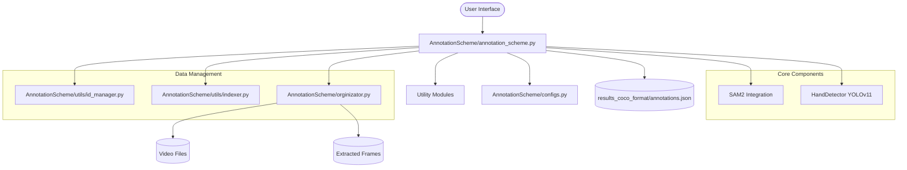

<!-- generated-by: gsd-doc-writer -->

# System Architecture

This document describes the high-level architecture of the Annotation Scheme project, a semi-automatic video annotation pipeline designed for object detection and segmentation tasks.

## System Overview

The Annotation Scheme is an interactive tool that streamlines the process of creating high-quality datasets for computer vision. It leverages **SAM2 (Segment Anything Model 2)** to propagate segmentation masks across video frames based on initial user prompts.

The system follows a semi-automatic workflow:
1.  **Detection**: Automatically detects hands and tools in the first frame using YOLOv11-pose.
2.  **Prompting**: Allows users to provide manual bounding boxes or point prompts to initialize or refine segmentation.
3.  **Propagation**: Uses SAM2 to track and segment the specified objects across subsequent frames.
4.  **Review**: Provides an interactive interface for users to validate, edit, or re-segment frames as needed.

Primary inputs are video files (`.mp4`, `.mov`), and primary outputs are COCO-format JSON annotations and extracted frame images.

## Component Diagram

The following diagram illustrates the relationships between the major modules:

## Data Flow

A typical annotation session follows these steps:

1.  **Data Preparation**: The `Orginizator` module uses `ffmpeg` to extract individual frames from a selected video and organizes them into a structured directory under `annotation_results/`.
2.  **Initialization**: `AnnotationScheme/annotation_scheme.py` loads the SAM2 predictor and the `HandDetector`. It also initializes the `IdManager` to track unique object instances.
3.  **Interactive Prompting**:
    - **Automatic Mode**: `HandDetector` runs YOLOv11-pose to suggest bounding boxes for hands and tools.
    - **Manual Mode**: The user interacts with the GUI to provide positive/negative points or bounding boxes.
4.  **Mask Propagation**: SAM2 takes the initial prompts and "propagates" the mask through the video (defaulting to 50-frame segments).
5.  **Refinement Loop**: The user reviews the generated masks. If an error is found, the user can "edit" the frame, providing new prompts that SAM2 uses to update the propagation.
6.  **Serialization**: Once the video is processed, the `IdManager` and `Indexer` ensure all annotations are correctly indexed and mapped to COCO categories.
7.  **Export**: The final results are written to `results_coco_format/`, containing `results_coco_format/annotations.json` and the corresponding `images/`.

## Key Abstractions

| Abstraction | File Location | Description |
|-------------|---------------|-------------|
| `IdManager` | `AnnotationScheme/utils/id_manager.py` | Manages the mapping between SAM2 internal IDs and user-facing labels/categories across video sessions. |
| `HandDetector` | `AnnotationScheme/utils/hand_detector.py` | A wrapper for YOLOv11-pose that provides automated initial prompts for hands and tools. |
| `Indexer` | `AnnotationScheme/utils/indexer.py` | Handles video file naming conventions (`v1_...`, `v2_...`) and tracks progress across a dataset. |
| `SAM2_ROOT` | `AnnotationScheme/utils/sam2_loader.py` | Manages path resolution and environment setup for the `segmentanything` submodule. |
| `configs.py` | `AnnotationScheme/configs.py` | Central repository for category mappings, UI colors, keyboard shortcuts, and model paths. |

## Directory Structure Rationale

The project is organized to separate the core annotation logic from the model implementations and data storage:

- `AnnotationScheme/`: Contains the primary application logic and custom utilities.
    - `api/`: Placeholder for future server/web integration.
    - `core/`: (Legacy/Placeholder) Intended for core inference engines.
    - `utils/`: Reusable helper modules for detection, ID management, and file indexing.
- `segmentanything/`: An external submodule containing the SAM2 codebase. This is kept separate to allow for independent updates.
- `assets/`: The default directory for raw input video files.
- `annotation_results/`: Intermediate storage for extracted frames and per-video state.
- `results_coco_format/`: The final destination for exported datasets ready for training.
- `tests/`: Contains automated tests for verifying the annotation logic and utilities.
- `logs/`: Application execution logs for debugging.

<!-- VERIFY: {https://github.com/facebookresearch/sam2/blob/main/INSTALL.md} -->
<!-- VERIFY: {https://arxiv.org/abs/xxx} -->
